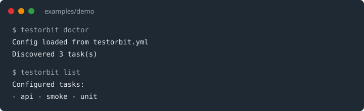
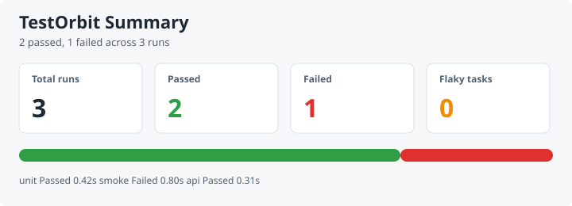

# TestOrbit

[](https://github.com/yihe2/testorbit/actions/workflows/ci.yml)
[](CHANGELOG.md)
[](https://www.python.org/downloads/)

TestOrbit is a lightweight CLI for named test tasks. Save commands in YAML, run them by alias, keep JSONL history, and render an HTML summary.

## Install

Python 3.11+ is required.

```powershell
pip install -e ".[dev]"
testorbit version
```

## Try The Demo

The repo includes a tiny shop app under `examples/demo` so you can use the CLI before writing your own config.

```powershell
cd examples/demo
testorbit doctor
testorbit list
testorbit run unit --dry-run
```

Full walkthrough: [docs/quickstart.md](docs/quickstart.md). Setup checks: [docs/setup.md](docs/setup.md).

## Screenshots

CLI against the demo project:



HTML summary cards:



Open the sample report at [docs/examples/summary.html](docs/examples/summary.html) for the full page, including the run table.

## What Ships

- CLI entrypoint: `testorbit`
- YAML config with named tasks such as `smoke`, `unit`, and `api`
- `init`, `doctor`, `list`, `show`, `run`, `history`, `export-history`, and `report`
- local JSONL run history and JSON export
- HTML summary with flaky-task hints
- quarantine list support
- GitHub Actions sample workflow
- demo project under `examples/demo`

Out of 1.0: include/exclude filters, failed-test retry, duration trends, and a first-class npm adapter. Use `command: npm test` for JavaScript suites. See [docs/adapters.md](docs/adapters.md).

## CLI Commands

```powershell
testorbit init
testorbit version
testorbit doctor
testorbit list
testorbit show unit
testorbit run unit --dry-run
testorbit run unit
testorbit history --history tmp/runs.jsonl
testorbit export-history --history tmp/runs.jsonl
testorbit report --history tmp/runs.jsonl
testorbit --ci report --history reports/runs.jsonl
```

`run` returns the same exit code as the configured command. Pass `--ci` in GitHub Actions; see [docs/ci.md](docs/ci.md).

## Docs

- [docs/README.md](docs/README.md) — index
- [docs/quickstart.md](docs/quickstart.md) — first run
- [docs/setup.md](docs/setup.md) — verify a clone
- [CHANGELOG.md](CHANGELOG.md) — release notes
- [docs/config-schema.md](docs/config-schema.md) and `testorbit.example.yml`
- [docs/troubleshooting.md](docs/troubleshooting.md)
